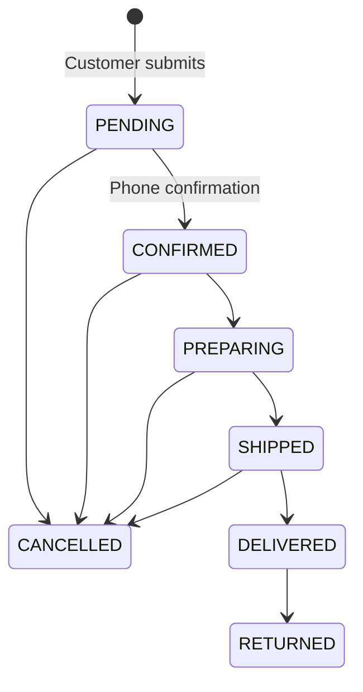

# Order workflow

Checkout runs in a serializable PostgreSQL transaction:

1. Validate the request and COD consent.
2. Collapse duplicate variant lines.
3. Reload active products/variants and current prices.
4. Conditionally decrement each stock row only when enough units remain.
5. Recalculate subtotal plus fixed 8 DT delivery.
6. Create the order, immutable items, first status history and inventory movements.
7. Create a first-party OrderPlaced event.
8. Return a deterministic HMAC-based access token derived from the idempotency key.

A failed step rolls back everything. Reusing an idempotency key returns the original order safely.

Cancelling any pre-delivery order or returning a delivered order restores inventory only when `restockedAt` is empty. The same transaction writes an audit movement. Delivered orders set COD status to PAID; returns set it to REFUNDED.
